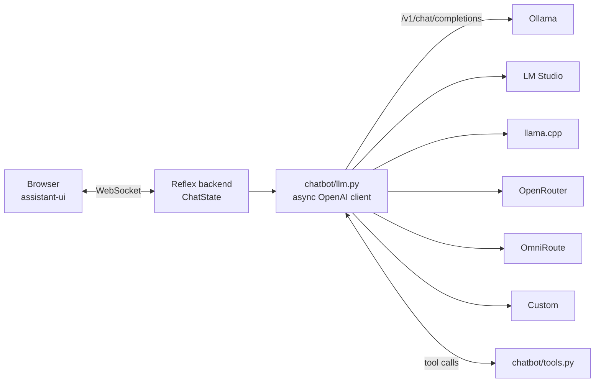

# Reflex Chatbot

A Python web chatbot built with [Reflex](https://reflex.dev) and
[reflex-assistant-ui](https://github.com/ecrespo/reflex-assistant-ui). It talks to
**any server that implements the OpenAI API** and ships preconfigured for:

| Provider | Type | Default URL |
| --- | --- | --- |
| [Ollama](https://ollama.com) | local | `http://localhost:11434/v1` |
| [LM Studio](https://lmstudio.ai) | local | `http://localhost:1234/v1` |
| [llama.cpp](https://github.com/ggml-org/llama.cpp) (`llama-server`) | local | `http://localhost:8080/v1` |
| [OpenRouter](https://openrouter.ai) | cloud | `https://openrouter.ai/api/v1` |
| [OmniRoute](https://github.com/diegosouzapw/OmniRoute) | local gateway | `http://localhost:20128/v1` |
| Custom (vLLM, LocalAI, LiteLLM, OpenAI, Groq…) | any | `CUSTOM_BASE_URL` |

Features:

- **Streaming** replies with a stop button.
- **Provider and model pickers** in the UI (models are discovered with `GET /v1/models`).
- **Tool calling**: current time, calculator and system info, easy to extend.
- **Reasoning** from *thinking* models (DeepSeek-R1, Qwen3, gpt-oss…) in a collapsible block,
  whether it arrives as `reasoning_content`, `reasoning` or `<think>` tags.
- Message editing and regeneration with conversation **branches**, markdown, syntax-highlighted code, 👍/👎.
- Fully configured through **`.env`**; API keys never leave the server.
- **Docker image** ready for Docker Hub, plus `docker compose` (with optional Ollama).

---

## Quick start (local Ollama)

Requirements: Python ≥ 3.13, [uv](https://docs.astral.sh/uv/) and Ollama.

```bash
# 1. A model in Ollama
ollama pull llama3.2
ollama serve            # unless it already runs as a service

# 2. Dependencies and configuration
uv sync
cp .env.example .env    # LLM_PROVIDER=ollama is the default

# 3. Run
uv run reflex run       # development → http://localhost:3000
```

Production mode on a single port (the same thing the Docker image does):

```bash
uv run reflex run --env prod --single-port --backend-port 3000
```

With `make`: `make install`, `make dev`, `make prod` (`make help` lists every target).

---

## How it works



Every provider speaks the same protocol (OpenAI Chat Completions), so a single
client (`openai.AsyncOpenAI`) covers all of them. A "provider" is just a base URL,
an API key, a default model and optional extras, all defined in `.env`.

```
chatbot/
├── chatbot.py   # page: header, provider/model toolbar, chat
├── state.py     # ChatState (AssistantUIState + provider/model selection)
├── llm.py       # streaming, tool-calling loop, reasoning normalisation
├── tools.py     # tools in OpenAI function-calling format
└── settings.py  # .env loading and provider presets
```

---

## Configuration (`.env`)

Copy `.env.example` to `.env`. Variables already set in the process environment
(`export`, `docker -e`, compose `environment:`) take precedence over the file.
`CHATBOT_ENV_FILE=/path/other.env` loads a different file.

### General variables

| Variable | Default | Description |
| --- | --- | --- |
| `LLM_PROVIDER` | `ollama` | Initial provider: `ollama`, `lmstudio`, `llamacpp`, `openrouter`, `omniroute`, `custom` |
| `LLM_ENABLED_PROVIDERS` | all | Providers shown in the picker, comma-separated |
| `LLM_TEMPERATURE` | `0.7` | Initial temperature (adjustable in the UI, 0–1.5) |
| `LLM_MAX_TOKENS` | empty | Output token limit; empty = server default |
| `LLM_ENABLE_TOOLS` | `true` | Enables function calling (toggle in the UI) |
| `LLM_MAX_TOOL_ROUNDS` | `4` | Maximum model → tool → model rounds |
| `LLM_SHOW_REASONING` | `true` | Shows the reasoning block (toggle in the UI) |
| `LLM_REASONING_EFFORT` | empty | When set (`low`/`medium`/`high`/`none`), `reasoning_effort` is sent |
| `LLM_REQUEST_TIMEOUT` | `120` | Seconds per request |
| `LLM_SYSTEM_PROMPT` | see `.env.example` | System prompt |
| `APP_TITLE`, `APP_WELCOME_TITLE`, `APP_WELCOME_SUBTITLE` | — | UI texts |
| `CHAT_STREAM_INTERVAL` | `0.05` | Minimum seconds between pushes to the browser while streaming |

### Per-provider variables

Each provider has a prefix: `OLLAMA_`, `LMSTUDIO_`, `LLAMACPP_`, `OPENROUTER_`,
`OMNIROUTE_`, `CUSTOM_`.

| Suffix | Description |
| --- | --- |
| `_BASE_URL` | OpenAI-compatible base URL (ends in `/v1`) |
| `_API_KEY` | Key. Local servers ignore it; OpenRouter requires it |
| `_MODEL` | Default model (always offered in the picker) |
| `_MODELS` | Fixed, comma-separated model list; when empty `/v1/models` is queried |
| `_HEADERS` | JSON with extra HTTP headers, e.g. `{"X-Org": "demo"}` |
| `_EXTRA_BODY` | JSON merged into every request body (provider-specific parameters) |
| `_LABEL` | Name shown in the UI |

OpenRouter only: `OPENROUTER_HTTP_REFERER` and `OPENROUTER_APP_TITLE` (attribution).

The detailed guide for each platform (how to start the server, what to put in
`.env`, tool and reasoning support) is in **[docs/PROVIDERS.md](docs/PROVIDERS.md)**.

Switching providers at a glance:

```bash
# LM Studio
LLM_PROVIDER=lmstudio            # and in LM Studio: Developer → Start Server

# llama.cpp
LLM_PROVIDER=llamacpp            # llama-server -hf ggml-org/gemma-3-4b-it-GGUF --jinja --port 8080

# OpenRouter
LLM_PROVIDER=openrouter
OPENROUTER_API_KEY=sk-or-v1-...
OPENROUTER_MODEL=openai/gpt-4o-mini

# OmniRoute
LLM_PROVIDER=omniroute           # npx omniroute  → http://localhost:20128
OMNIROUTE_MODEL=auto
```

---

## Using the UI

- **Provider**: the first picker. Changing it queries that provider's models.
- **Model**: models offered by the server (or `*_MODELS`). **Modelos** re-queries them
  (useful after `ollama pull` or after loading another model in LM Studio).
- **temp**: temperature for the next replies.
- **herramientas** (tools): turns function calling on/off. If a model does not support tools,
  the chatbot detects it, retries without them and remembers that for the model.
- **razonamiento** (reasoning): shows or hides the thinking block.
- **Nuevo chat**: clears the conversation.
- The header badge shows the connection state (green = connected); hovering shows the URL or the error.
  When the provider does not answer, a banner explains why and how to start it.
- On messages: copy, regenerate (creates a branch), edit your own messages (creates a branch) and 👍/👎.

The UI labels are in Spanish; change them in `chatbot/chatbot.py` and the `APP_*` variables.

---

## Docker

Summary (details in **[docs/DOCKER.md](docs/DOCKER.md)**):

```bash
cp .env.example .env

# LLM running on your machine (Ollama, LM Studio, llama.cpp, OmniRoute) or OpenRouter
docker compose up -d --build                 # → http://localhost:3000

# Ollama inside compose, pulling OLLAMA_PULL_MODELS
docker compose -f docker-compose.yml -f docker-compose.ollama.yml up -d --build
```

Inside the container `localhost` is the container itself, so `docker-compose.yml`
rewrites the local URLs to `host.docker.internal` (`DOCKER_*_BASE_URL` variables).
On Linux the host server must listen on `0.0.0.0`, e.g. `OLLAMA_HOST=0.0.0.0:11434`.

### Publishing to Docker Hub

```bash
docker login
make docker-push DOCKERHUB_USER=<your_user>          # :latest and :<version>
make docker-buildx DOCKERHUB_USER=<your_user>        # multi-arch amd64 + arm64
```

Or with compose: `DOCKERHUB_USER=<your_user> docker compose build && docker compose push`.
The `.github/workflows/docker-publish.yml` workflow publishes automatically when a
`v*` tag is pushed (secrets `DOCKERHUB_USERNAME` and `DOCKERHUB_TOKEN`).

To run the published image on another machine you only need `docker-compose.yml` and a `.env`:

```bash
docker compose pull && docker compose up -d
```

---

## Extending

**New tool** — in `chatbot/tools.py`:

```python
@tool(
    "get_weather",
    "Return the current weather for a city.",
    {"type": "object", "properties": {"city": {"type": "string"}}, "required": ["city"]},
)
async def get_weather(city: str) -> dict:
    return {"city": city, "temp_c": 29}
```

It is sent to the models automatically, and its call and result are rendered in the chat.

**New named provider** — add an entry to `PROVIDER_PRESETS` in
`chatbot/settings.py` (key, variable prefix, label, default URL) and add its key
to `LLM_ENABLED_PROVIDERS`. For a one-off endpoint, `CUSTOM_*` is enough.

---

## Troubleshooting

| Symptom | Cause / fix |
| --- | --- |
| "no se pudo conectar con http://localhost:11434/v1" (could not connect) | Ollama is not running (`ollama serve`) or the URL is different |
| Works locally but not in Docker | Use `host.docker.internal` and make the server listen on `0.0.0.0` (see docs/DOCKER.md) |
| "sin modelos" (no models) | No model pulled/loaded: `ollama pull …`, load one in LM Studio, or set `*_MODEL` / `*_MODELS` |
| HTTP 401 from OpenRouter | `OPENROUTER_API_KEY` is missing or invalid |
| The model does not use tools | Not every model supports them; start llama.cpp with `--jinja`. Tools can be switched off in the UI |
| Timeouts with large models | Raise `LLM_REQUEST_TIMEOUT` |
| The UI loads but never connects after mapping another port (`8080:3000`) | Use the same port on both sides (`PORT=8080`) or set `REFLEX_API_URL` |

## License

MIT — see [LICENSE](LICENSE).
